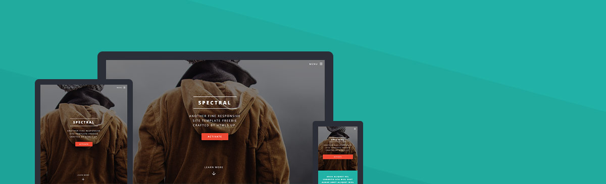

# starodubtsev-consulting-frontend

Based on Spectral by HTML5 UP

For an overview of the project structure please refer to the [Gatsby documentation - Building with Components](https://www.gatsbyjs.org/docs/building-with-components/).



Check online preview [here](https://starodubtsev-consulting.github.io/gatsby-starter-spectral/)

## Install

Make sure that you have the Gatsby CLI program installed:

```sh
npm install --global gatsby-cli
```

Run from your CLI:


```sh
cd starodubtsev-consulting-frontend
npm install
gatsby develop```


### License

Private.
